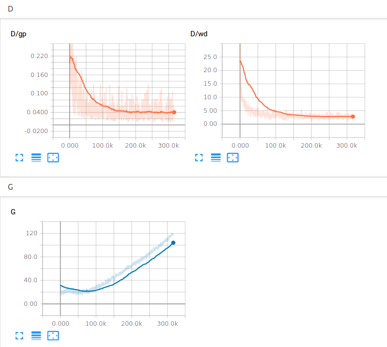
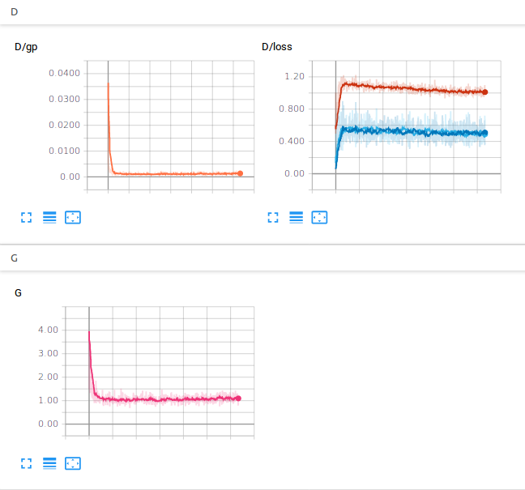

***Recommendation***

- Our GAN based work for facial attribute editing - https://github.com/LynnHo/AttGAN-Tensorflow.

---

# WGAN-GP and DRAGAN

Pytorch implementation of WGAN-GP and DRAGAN, both of which use gradient penalty to enhance the training quality. We use DCGAN as the network architecture in all experiments.

WGAN-GP: [Improved Training of Wasserstein GANs](http://arxiv.org/abs/1704.00028)

DRAGAN: [On Convergence and Stability of GANs](https://arxiv.org/abs/1705.07215)

## Exemplar results

### Celeba
left: WGAN-GP 100 epoch, right: DRAGAN 100 epoch

 

### Loss curves (very stable training!!!)
left: WGAN-GP 100 epoch, right: DRAGAN 100 epoch

 

# Prerequisites
- pytorch 0.2
- tensorboardX https://github.com/lanpa/tensorboard-pytorch
- python 2.7

# Usage

### Configuration

You can directly change some configurations such as gpu_id and learning rate etc. in the head of each code.
### Train
```
python train_celeba_wgan_gp.py
python train_celeba_dragan.py
...
```
### Tensorboard
If you have installed tensorboard, you can use it to have a look at the loss curves.
```
tensorboard --logdir=./summaries/celeba_wgan_gp --port=6006
...
```

### Datasets
1. Celeba should be prepared by yourself in ***./data/img_align_celeba/img_align_celeba/***
    - Download the dataset: https://www.dropbox.com/sh/8oqt9vytwxb3s4r/AAB06FXaQRUNtjW9ntaoPGvCa?dl=0
    - the above links might be inaccessible, the alternative is
        - ***img_align_celeba.zip***
            - https://pan.baidu.com/s/1eSNpdRG#list/path=%2FCelebA%2FImg or
            - https://drive.google.com/drive/folders/0B7EVK8r0v71pTUZsaXdaSnZBZzg
